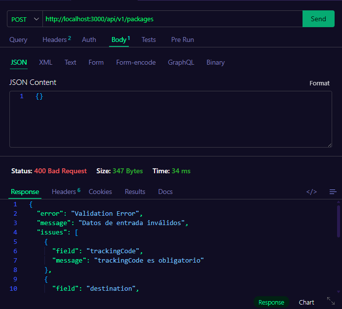
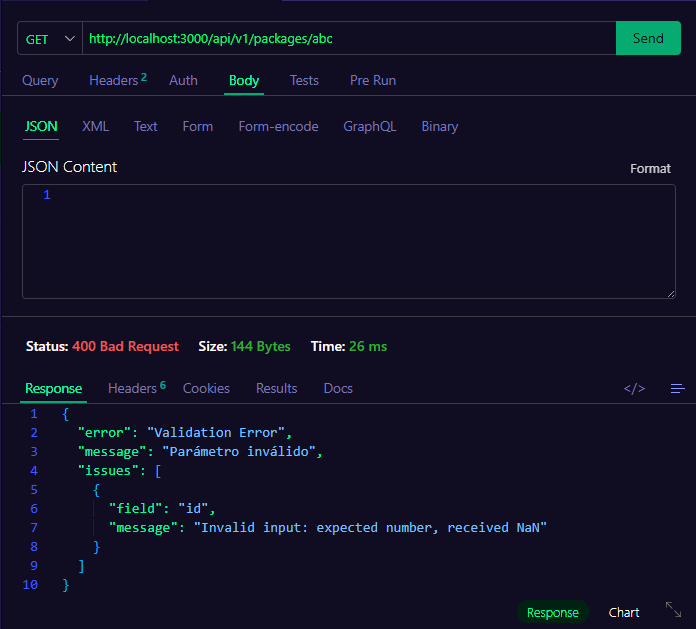
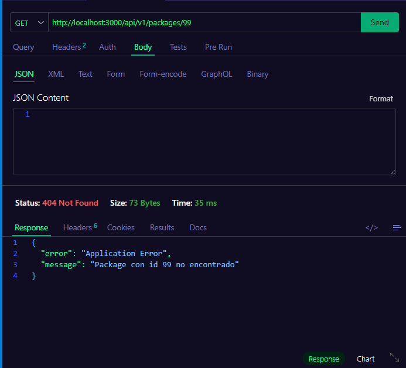
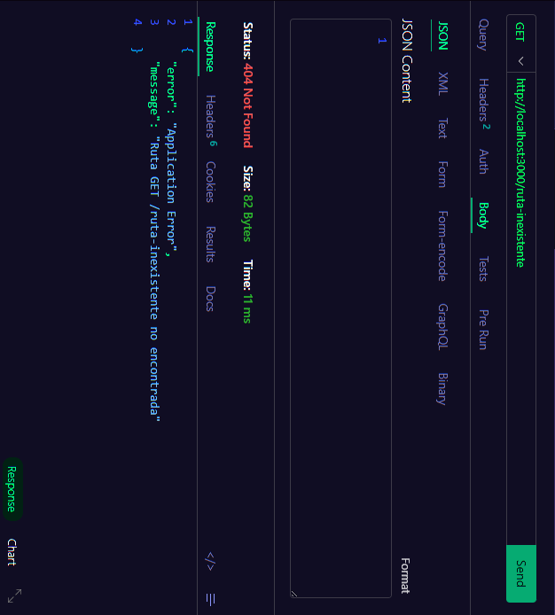
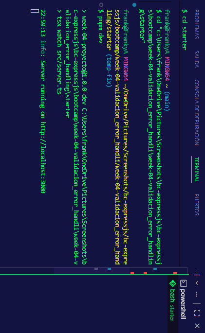

# Proyecto Semana 04: Validación, Errores y Logging

## Dominio asignado

**Empresa de mensajería / Courier** — recurso principal: `Package` (paquete)

---

## Campos del schema y sus validaciones

| Campo | Tipo | Validación |
|---|---|---|
| `trackingCode` | string | Obligatorio, mínimo 3 caracteres |
| `destination` | string | Obligatorio, mínimo 3 caracteres |
| `weight` | number | Obligatorio, debe ser mayor a 0 (kg) |
| `status` | enum | `pending`, `in_transit` o `delivered` — default `pending` |
| `customerName` | string | Obligatorio, no puede estar vacío |

---

## Endpoints

| Método | Ruta | Descripción |
|---|---|---|
| `GET` | `/api/v1/packages` | Listar con paginación (`?page=1&limit=10`) |
| `GET` | `/api/v1/packages/:id` | Obtener paquete por id |
| `POST` | `/api/v1/packages` | Crear paquete validando con Zod |
| `PUT` | `/api/v1/packages/:id` | Actualizar paquete (campos opcionales) |
| `DELETE` | `/api/v1/packages/:id` | Eliminar paquete |

---

## Cómo ejecutar el proyecto

```bash
cd starter
pnpm install
pnpm dev
```

El servidor queda disponible en `http://localhost:3000`.

---

## Ejemplos de uso

**Crear un paquete:**
```json
POST /api/v1/packages
{
  "trackingCode": "PKG-100",
  "destination": "Calle 80 #45-12, Bogotá",
  "weight": 1.5,
  "status": "pending",
  "customerName": "Laura Pérez"
}
```

## Capturas de pantalla

### 1. POST con body inválido → 400


### 2. GET con id no numérico → 400


### 3. GET con id inexistente → 404


### 4. Ruta inexistente → 404 JSON


### 5. Logs en consola


---

**Body inválido → 400:**
```json
POST /api/v1/packages
{}

// Respuesta:
{
  "error": "Validation Error",
  "message": "Datos de entrada inválidos",
  "issues": [
    { "field": "trackingCode", "message": "trackingCode es obligatorio" },
    { "field": "destination", "message": "destination es obligatorio" },
    { "field": "weight", "message": "weight es obligatorio y debe ser un número" },
    { "field": "customerName", "message": "customerName es obligatorio" }
  ]
}
```

**Id inexistente → 404:**
```json
GET /api/v1/packages/99

// Respuesta:
{ "error": "Application Error", "message": "Package con id 99 no encontrado" }
```

**Id no numérico → 400:**
```json
GET /api/v1/packages/abc

// Respuesta:
{ "error": "Validation Error", "message": "Parámetro inválido", "issues": [...] }
```

**Ruta inexistente → 404 JSON:**
```json
GET /ruta-inexistente

// Respuesta:
{ "error": "Application Error", "message": "Ruta GET /ruta-inexistente no encontrada" }
```
