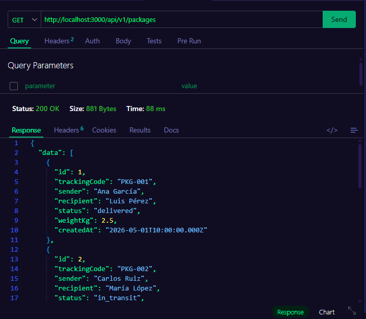
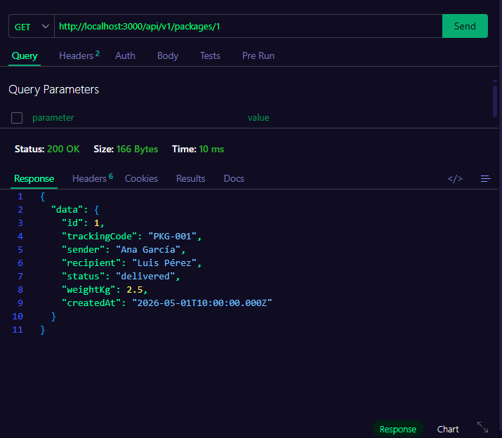
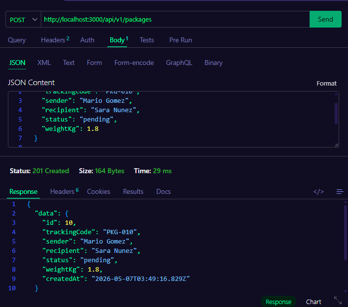
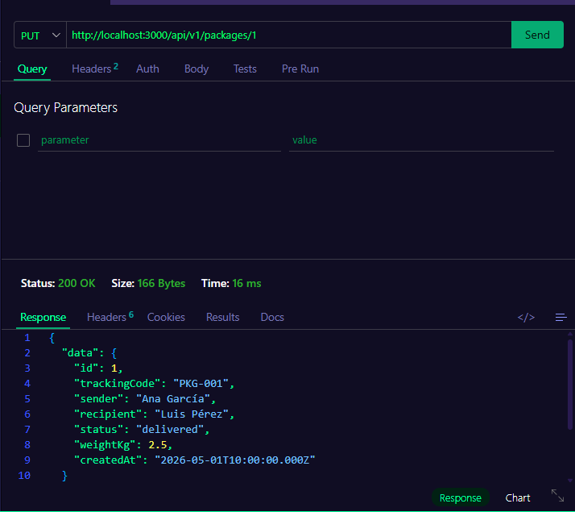
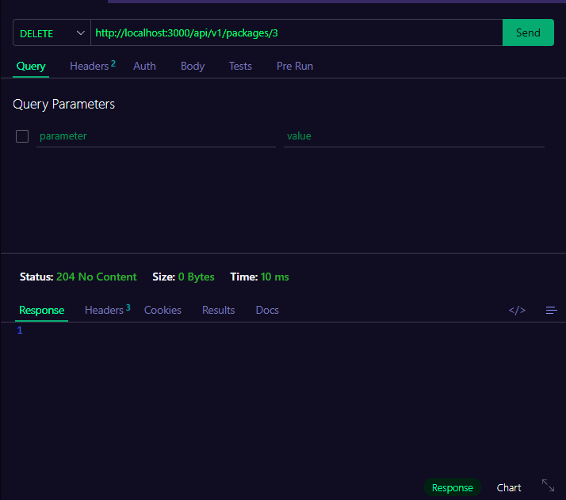

# Proyecto Semana 03 — API REST con Arquitectura en Capas

## Dominio: Empresa de Mensajería / Courier

API REST para gestión de paquetes de una empresa de mensajería, construida con arquitectura en 4 capas.

---

## Recurso: `packages`

### Campos

| Campo         | Tipo                                                | Descripción              |
|---------------|-----------------------------------------------------|--------------------------|
| `id`          | `number`                                            | ID auto-incremental      |
| `trackingCode`| `string`                                            | Código de rastreo único  |
| `sender`      | `string`                                            | Nombre del remitente     |
| `recipient`   | `string`                                            | Nombre del destinatario  |
| `status`      | `pending` \| `in_transit` \| `delivered` \| `cancelled` | Estado del paquete  |
| `weightKg`    | `number`                                            | Peso en kilogramos       |
| `createdAt`   | `string`                                            | Fecha de creación (ISO)  |

---

## Endpoints

| Método | Ruta                       | Status | Descripción                        |
|--------|----------------------------|--------|------------------------------------|
| GET    | `/api/v1/packages`         | 200    | Listar con paginación `?page&limit`|
| GET    | `/api/v1/packages/:id`     | 200    | Obtener paquete por ID             |
| POST   | `/api/v1/packages`         | 201    | Crear nuevo paquete                |
| PUT    | `/api/v1/packages/:id`     | 200    | Actualizar paquete existente       |
| DELETE | `/api/v1/packages/:id`     | 204    | Eliminar paquete                   |

---

## Ejemplos

### GET /api/v1/packages?page=1&limit=2
```json
{
  "data": [
    {
      "id": 1,
      "trackingCode": "PKG-001",
      "sender": "Ana García",
      "recipient": "Luis Pérez",
      "status": "delivered",
      "weightKg": 2.5,
      "createdAt": "2026-05-01T10:00:00.000Z"
    }
  ],
  "total": 5,
  "page": 1,
  "limit": 2
}
```

### GET /api/v1/packages/1
```json
{
  "data": {
    "id": 1,
    "trackingCode": "PKG-001",
    "sender": "Ana García",
    "recipient": "Luis Pérez",
    "status": "delivered",
    "weightKg": 2.5,
    "createdAt": "2026-05-01T10:00:00.000Z"
  }
}
```

### POST /api/v1/packages
```json
// Request body
{
  "trackingCode": "PKG-006",
  "sender": "Mario Gómez",
  "recipient": "Sara Núñez",
  "status": "pending",
  "weightKg": 1.8
}

// Response 201
{
  "data": {
    "id": 6,
    "trackingCode": "PKG-006",
    "sender": "Mario Gómez",
    "recipient": "Sara Núñez",
    "status": "pending",
    "weightKg": 1.8,
    "createdAt": "2026-05-06T..."
  }
}
```

### GET /api/v1/packages/999
```json
{ "error": "Not Found", "message": "Package 999 not found" }
```

---

## Arquitectura

```
src/
├── app.ts
├── server.ts
├── types.ts
├── routes/
│   └── packages.routes.ts
├── controllers/
│   └── packages.controller.ts
├── services/
│   └── packages.service.ts
└── repositories/
    └── packages.repository.ts
```

## Comandos

```bash
pnpm dev      # Desarrollo con hot reload
pnpm build    # Compilar TypeScript
pnpm start    # Producción
```

---

## Screenshots — Thunder Client

### GET /api/v1/packages


### GET /api/v1/packages/1


### POST /api/v1/packages


### PUT /api/v1/packages/1


### DELETE /api/v1/packages/3

