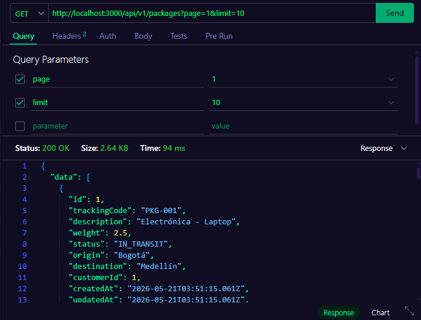
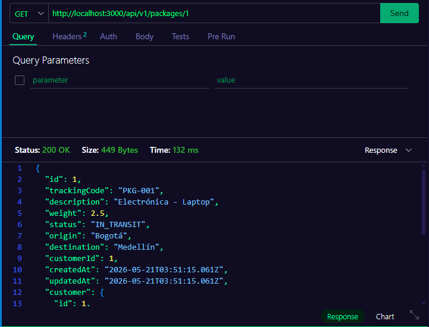
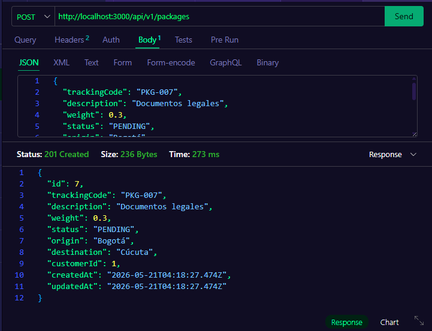
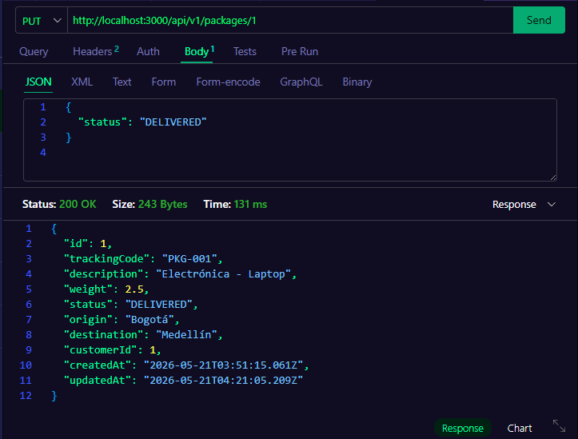
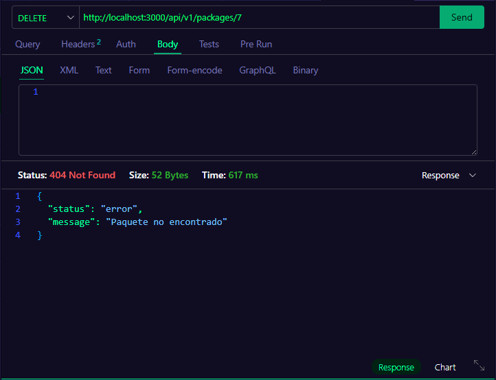

# Proyecto Semana 05 — Empresa de Mensajería / Courier API

## Descripción del dominio

API REST para una empresa de mensajería que gestiona **paquetes** y sus **clientes**. Permite rastrear envíos con código único, conocer su estado (PENDING, IN_TRANSIT, DELIVERED, RETURNED) y consultar qué cliente realizó cada envío.

## Diagrama de entidades

```
Customer (1) ──────────── (N) Package
─────────────────────          ──────────────────────────
id          Int PK             id            Int PK
name        String             trackingCode  String UNIQUE
email       String UNIQUE      description   String
phone       String             weight        Float
address     String             status        PackageStatus
createdAt   DateTime           origin        String
updatedAt   DateTime           destination   String
                               customerId    Int FK
                               createdAt     DateTime
                               updatedAt     DateTime

           PackageStatus: PENDING | IN_TRANSIT | DELIVERED | RETURNED
```

---

## Endpoints

### GET /api/v1/packages — Listado paginado

**Request**
```
GET /api/v1/packages?page=1&limit=10
```

**Response 200**
```json
{
  "data": [
    {
      "id": 1,
      "trackingCode": "PKG-001",
      "description": "Electrónica - Laptop",
      "weight": 2.5,
      "status": "IN_TRANSIT",
      "origin": "Bogotá",
      "destination": "Medellín",
      "customerId": 1,
      "createdAt": "2026-05-21T03:51:15.061Z",
      "updatedAt": "2026-05-21T03:51:15.061Z",
      "customer": {
        "id": 1,
        "name": "Carlos Mendez",
        "email": "carlos@email.com",
        "phone": "3001234567",
        "address": "Calle 10 #5-20, Bogotá"
      }
    }
  ],
  "total": 6,
  "page": 1,
  "limit": 10
}
```

---

### GET /api/v1/packages/:id — Detalle de un paquete

**Request**
```
GET /api/v1/packages/1
```

**Response 200**
```json
{
  "id": 1,
  "trackingCode": "PKG-001",
  "description": "Electrónica - Laptop",
  "weight": 2.5,
  "status": "IN_TRANSIT",
  "origin": "Bogotá",
  "destination": "Medellín",
  "customerId": 1,
  "customer": { "id": 1, "name": "Carlos Mendez", "email": "carlos@email.com" }
}
```

**Response 404**
```json
{ "status": "error", "message": "Paquete no encontrado" }
```

---

### POST /api/v1/packages — Crear paquete

**Request**
```json
{
  "trackingCode": "PKG-007",
  "description": "Documentos legales",
  "weight": 0.3,
  "status": "PENDING",
  "origin": "Bogotá",
  "destination": "Cúcuta",
  "customerId": 1
}
```

**Response 201**
```json
{
  "id": 7,
  "trackingCode": "PKG-007",
  "description": "Documentos legales",
  "weight": 0.3,
  "status": "PENDING",
  "origin": "Bogotá",
  "destination": "Cúcuta",
  "customerId": 1
}
```

**Response 400** — campos inválidos
```json
{ "status": "error", "message": "Required" }
```

**Response 409** — trackingCode duplicado
```json
{ "status": "error", "message": "Ya existe un paquete con ese código de rastreo" }
```

---

### PUT /api/v1/packages/:id — Actualizar paquete

**Request**
```json
{ "status": "DELIVERED" }
```

**Response 200**
```json
{
  "id": 1,
  "trackingCode": "PKG-001",
  "status": "DELIVERED",
  ...
}
```

**Response 404**
```json
{ "status": "error", "message": "Paquete no encontrado" }
```

---

### DELETE /api/v1/packages/:id — Eliminar paquete

**Response 204** — sin body

**Response 404**
```json
{ "status": "error", "message": "Paquete no encontrado" }
```

---

## Screenshots Postman

### GET /api/v1/packages


### GET /api/v1/packages/:id


### POST /api/v1/packages


### PUT /api/v1/packages/:id


### DELETE /api/v1/packages/:id


---

## Logs del seed

```
🌱 Iniciando seed...
✅ 3 clientes creados
✅ 6 paquetes creados
The seed command has been executed.
```

---

## Iniciar el proyecto

```bash
# 1. Levantar PostgreSQL
docker compose up -d

# 2. Instalar dependencias
pnpm install

# 3. Copiar variables de entorno
cp .env.example .env

# 4. Ejecutar migración
pnpm exec prisma migrate dev --name init

# 5. Ejecutar seed
pnpm exec prisma db seed

# 6. Iniciar servidor
pnpm dev
```

## Estructura del proyecto

```
starter/
├── prisma.config.ts
├── prisma/
│   ├── schema.prisma       ← modelos Customer y Package
│   ├── seed.ts             ← 3 clientes + 6 paquetes
│   └── migrations/
└── src/
    ├── lib/prisma.ts       ← singleton PrismaClient con adapter pg
    ├── schemas/            ← validación Zod (createPackageSchema)
    ├── repositories/       ← CRUD Prisma + manejo P2002/P2025
    ├── services/           ← lógica de negocio
    ├── controllers/        ← capa HTTP
    └── routes/             ← GET / GET:id / POST / PUT / DELETE
```
