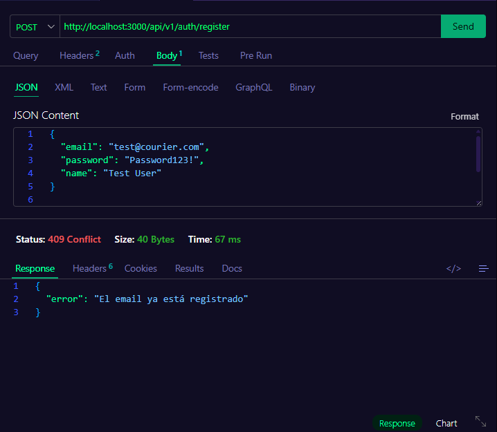
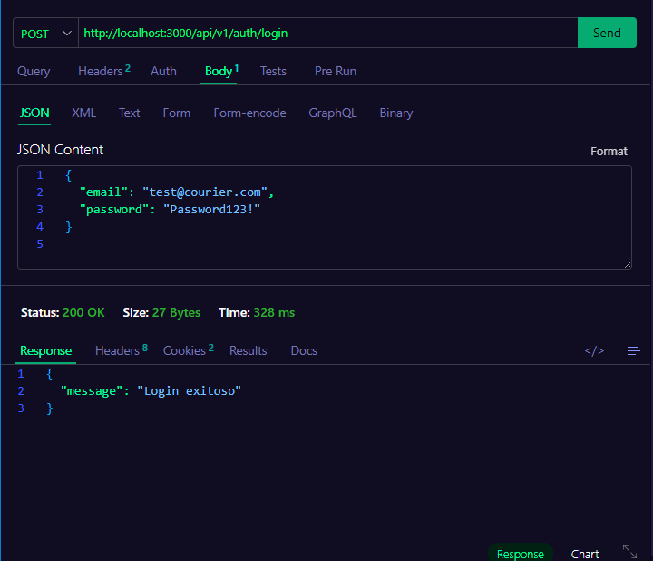
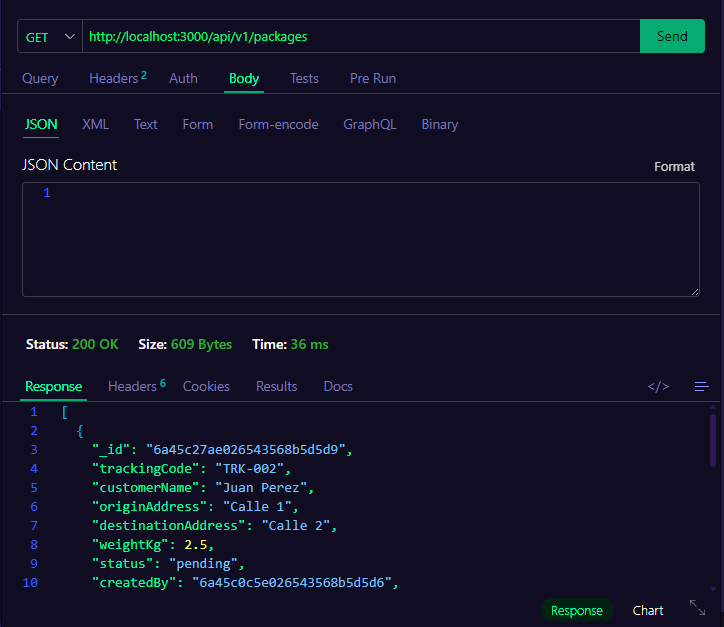
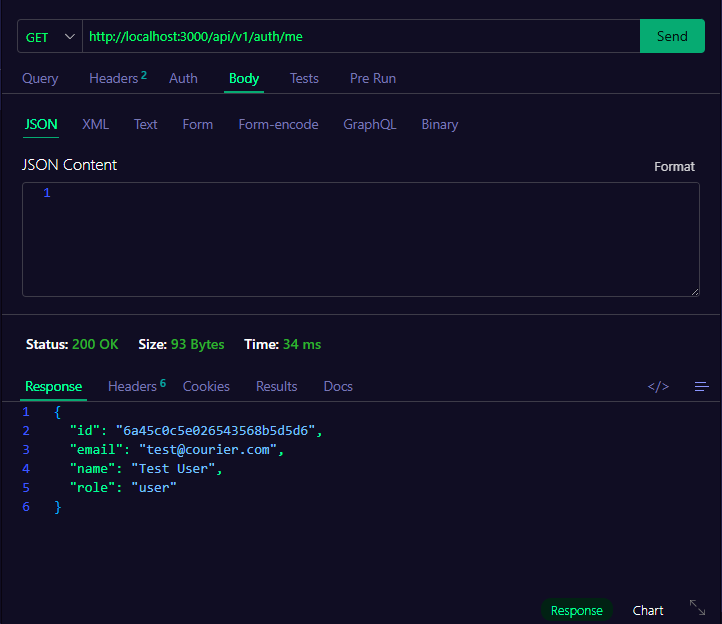
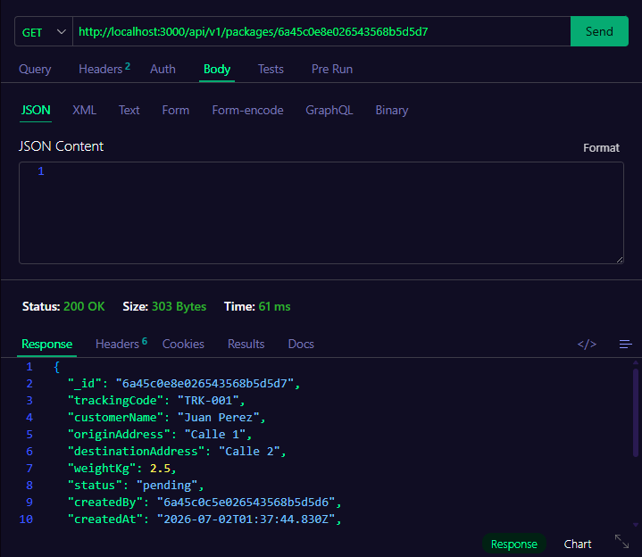
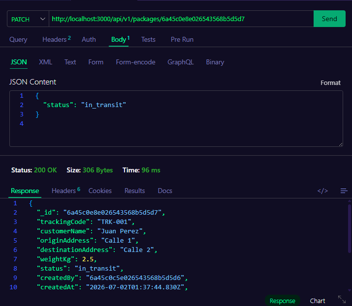
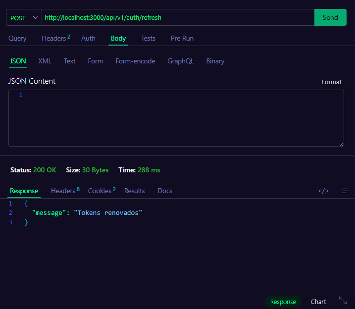
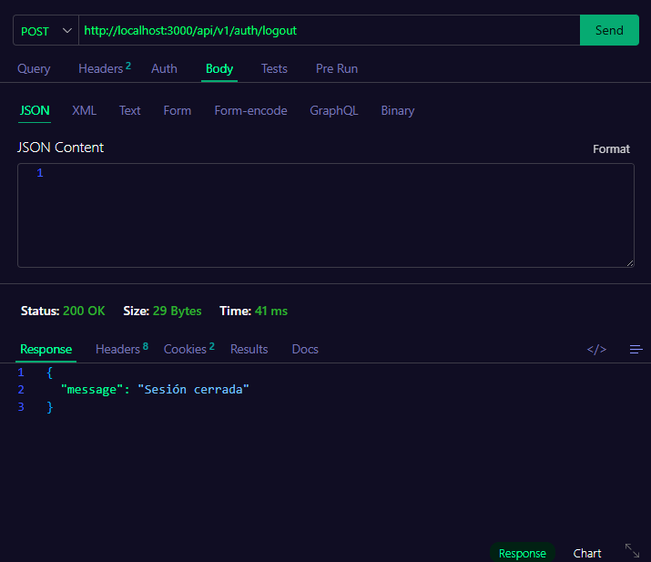
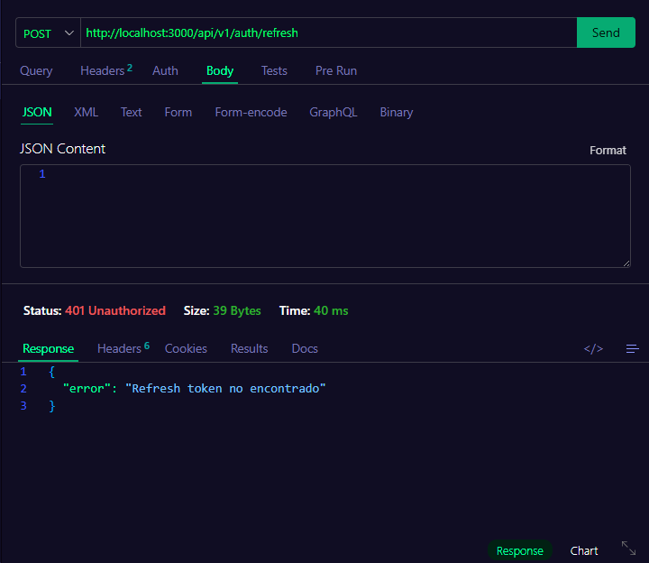

# 🚀 Proyecto Semanal: API con Autenticación JWT Completa

## 🎯 Objetivo

Implementar un sistema de autenticación completo con **bcrypt**, **JWT access/refresh tokens** y **cookies HttpOnly**, aplicado al dominio que el instructor te asignó. La API protegerá un recurso principal de tu dominio con rutas privadas.

---

## 🚚 Mi Dominio: Empresa de Mensajería (Courier)

**Dominio asignado**: Empresa de mensajería — packages, routes, drivers, customers.

**Recurso principal implementado**: `Package` (Paquete)

| Campo | Tipo | Descripción |
|-------|------|-------------|
| `trackingCode` | string (único) | Código de rastreo del paquete |
| `customerName` | string | Nombre del cliente |
| `originAddress` | string | Dirección de origen |
| `destinationAddress` | string | Dirección de destino |
| `weightKg` | number | Peso del paquete en kilogramos |
| `status` | enum | `pending` \| `in_transit` \| `delivered` \| `cancelled` |
| `driverName` | string (opcional) | Conductor asignado |
| `route` | string (opcional) | Ruta asignada |
| `createdBy` | ObjectId (ref User) | Usuario que registró el paquete |

Endpoints: `GET/POST /api/v1/packages`, `GET/PATCH/DELETE /api/v1/packages/:id` — todos protegidos con `authMiddleware`.

---

## ✅ Requisitos Funcionales

### Autenticación (obligatorio — ya implementado en el starter)

- `POST /api/v1/auth/register` — registro con hash de contraseña
- `POST /api/v1/auth/login` — login que emite access + refresh token en cookies HttpOnly
- `GET /api/v1/auth/me` — perfil del usuario autenticado (ruta protegida)
- `POST /api/v1/auth/refresh` — renueva access token usando refresh token con rotación
- `POST /api/v1/auth/logout` — invalida refresh token y limpia cookies

### CRUD del Recurso Principal (Paquetes)

1. **Listar paquetes** — `GET /api/v1/packages` — solo usuarios autenticados
2. **Obtener paquete** — `GET /api/v1/packages/:id` — devuelve 404 si no existe
3. **Crear paquete** — `POST /api/v1/packages` — valida con Zod, devuelve 201
4. **Actualizar paquete** — `PATCH /api/v1/packages/:id` — actualización parcial
5. **Eliminar paquete** — `DELETE /api/v1/packages/:id` — devuelve 204

Todas las rutas de paquetes están **protegidas** con `authMiddleware`.

---

## 🗂️ Estructura del Proyecto

```
starter/
├── package.json
├── tsconfig.json
├── .env
├── docker-compose.yml
└── src/
    ├── app.ts                          # monta auth + package router
    ├── server.ts                       # connectDB + listen
    ├── lib/
    │   └── mongoose.ts                 # connectDB/disconnectDB
    ├── errors/
    │   └── AppError.ts                 # clase de error con statusCode
    ├── types/
    │   └── express.d.ts                # req.user tipado globalmente
    ├── utils/
    │   └── jwt.ts                      # sign/verify access + refresh
    ├── middlewares/
    │   ├── auth.middleware.ts           # authMiddleware implementado
    │   ├── errorHandler.ts             # incluye manejo de CastError → 404
    │   └── notFound.ts
    ├── schemas/
    │   ├── auth.schema.ts              # register/login Zod schemas
    │   └── package.schema.ts           # createPackageSchema / updatePackageSchema
    ├── models/
    │   ├── user.model.ts
    │   └── package.model.ts            # modelo Mongoose del paquete
    ├── repositories/
    │   ├── users.repository.ts
    │   └── package.repository.ts       # operaciones CRUD de paquetes
    ├── services/
    │   ├── auth.service.ts
    │   └── package.service.ts          # lógica de negocio de paquetes
    ├── controllers/
    │   ├── auth.controller.ts
    │   └── package.controller.ts       # handlers HTTP de paquetes
    └── routes/
        ├── auth.routes.ts
        └── package.routes.ts           # rutas CRUD de paquetes (/api/v1/packages)
```

---

## 🛠️ Cómo correr el proyecto

```bash
cd starter
pnpm install
docker compose up -d   # levanta MongoDB
pnpm dev                # http://localhost:3000
```

El `.env` ya está configurado con `MONGODB_URI`, `JWT_ACCESS_SECRET` y `JWT_REFRESH_SECRET` (secrets distintos entre sí).

Flujo de prueba (Thunder Client / Postman):
1. `POST /api/v1/auth/register` → `POST /api/v1/auth/login` → cookies HttpOnly
2. `POST /api/v1/packages` → `GET /api/v1/packages` → `GET /api/v1/packages/:id` → `PATCH /api/v1/packages/:id` → `DELETE /api/v1/packages/:id`
3. `GET /api/v1/packages` sin cookie → `401`
4. `POST /api/v1/auth/refresh` → nuevos tokens → `POST /api/v1/auth/logout` → refresh posterior → `401`

---

## 📸 Entregables

1. **API funcional** con todos los endpoints respondiendo correctamente
2. **Screenshots** de Thunder Client / Postman mostrando:
   - Register exitoso
   - Login con cookies en la respuesta
   - CRUD completo del recurso (5 operaciones)
   - Acceso sin token → 401
   - Refresh exitoso → nuevo cookie
   - Logout y refresh posterior → 401
3. **Código fuente** con tu dominio aplicado (no el nombre genérico `resource`)
4. **README** actualizado con tu dominio y descripción de tu recurso

---

## 🔐 Criterios de Seguridad Obligatorios

| Criterio | Descripción |
|----------|-------------|
| Contraseñas hasheadas | `bcrypt.hash()` con salt rounds 10 |
| Secrets distintos | `JWT_ACCESS_SECRET` ≠ `JWT_REFRESH_SECRET` |
| Tokens en cookies HttpOnly | Nunca en `localStorage` ni en body |
| Refresh token hasheado en DB | Solo el hash se almacena, no el token en claro |
| Rotación de refresh token | Cada `/refresh` invalida el anterior |
| Rutas protegidas | Todas las rutas del recurso usan `authMiddleware` |
| Sin secrets hardcodeados | Solo en `.env`, nunca en el código |

---

## 📸 Capturas de Pantalla

### Register exitoso


### Login con cookies en la respuesta


### Crear paquete


### Listar paquetes


### Obtener paquete por ID


### Actualizar paquete


### Refresh exitoso


### Logout


### Refresh después de logout (401)


---

## 🔗 Navegación

← [Semana 06: MongoDB + Mongoose](../../week-06/README.md) | [Semana 08: Autorización y Seguridad →](../../week-08/README.md)
